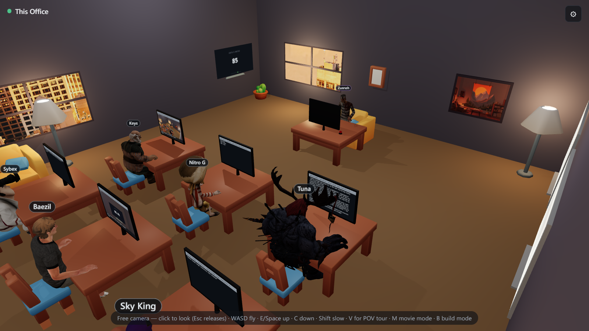
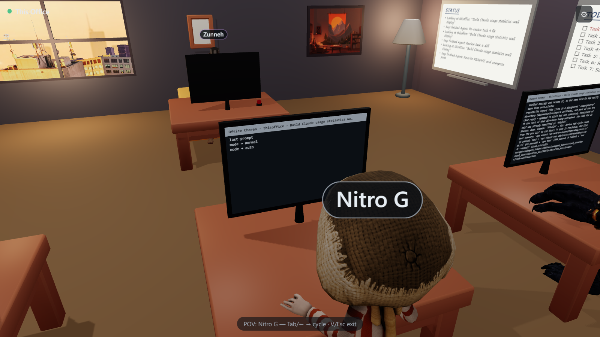
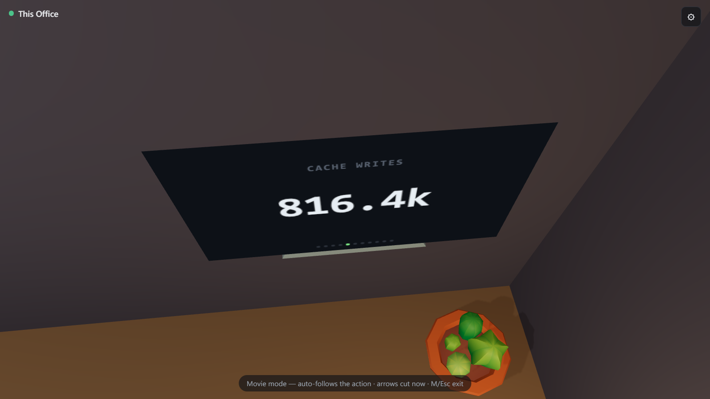

# This Office

A Claude visualizer. Your live Claude Code sessions play out as a 3D office:
prompts arrive on the boss's monitor, tool calls run on the employees' screens,
and the office hires more staff when it gets busy.

There's a TV that keeps track of your Claude usage stats:

## Run

    docker compose up

Open http://localhost:5173.

## How It Works

Claude Code writes a transcript of every session to your local Claude home
folder (`~/.claude/projects/`). This Office tails those transcript files and
turns what it finds into office activity: your prompts land on the boss's
monitor, every tool call lights up an employee's screen, and subagents get
desks of their own.

Because it reads straight from the local folder, it sees every Claude Code
session on your machine — every project, every terminal, running or resumed —
and visualizes all of them out of the box. No hooks, no wrappers, no per-project
setup: just the one startup command above.

## Advanced

Change the ports by setting `WEB_PORT` (the page) and `SERVER_PORT` before
starting:

    WEB_PORT=8080 SERVER_PORT=4700 docker compose up

You can put your own characters in the office. Download a character from Mixamo
and drop it on the Import tab in the settings, or model one in Blender on the
skeleton the office provides — see docs/blender-characters.md, which walks
through wiring Blender up to Claude so it builds the character for you.

Characters and furniture are CC0 asset packs — see ATTRIBUTION.md.
